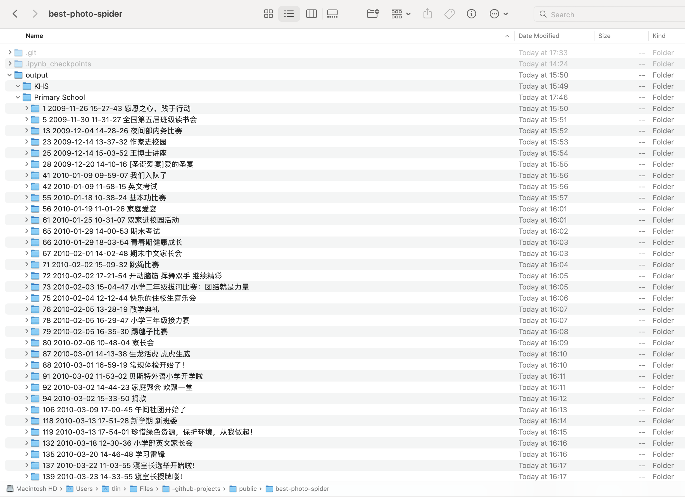

# Photo Spider for Best Educational Organization

This project aims to scrape photos from news articles in [Best Educational Organization's website](https://www.bestsch.cn/best/public/news), especially those from Best International Primary School and Kinglee High School.

## Installation

This code is tested on macOS, so it may need additional setup on Windows.

### Software Prerequisite

1. Install [Anaconda](https://www.anaconda.com/products/distribution) or [Miniconda](https://docs.conda.io/en/latest/miniconda.html).
2. Download this repository to your computer (Most conveniently done by `git clone`).

### Setting up `conda` environment

1. Open Anaconda command prompt.
2. `cd` into project directory
3. Type `conda env create -f environment.yml` to create conda environment

### Run the code

1. In the Anaconda command prompt, type `jupyter-lab`. Jupyter Lab should open in your browser
2. Navigate to find the `.ipynb` file and run the code.

## Demo Output

